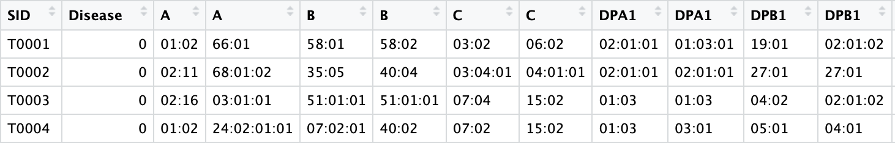
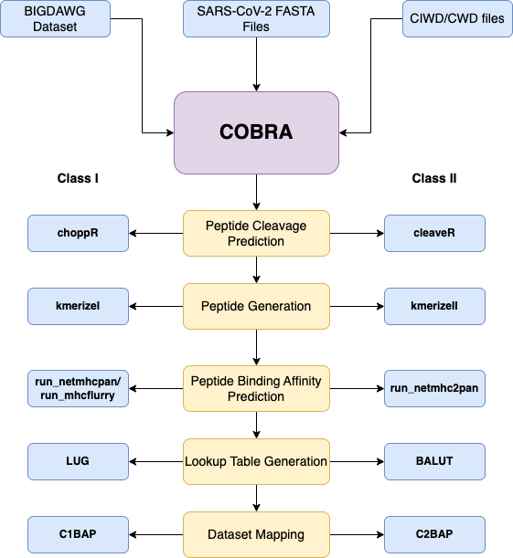
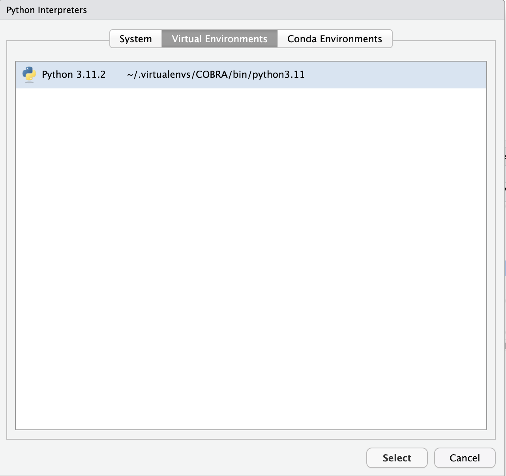

------------------------------------------------------------------------

-   Package Version: 0.2.0.900

## Overview

NOTE: COBRA is only compatible with Linux and Darwin, as many of the
required softwares are only available for those operating systems.
Functions in R calling the required software were developed using zsh on
Mac OS 11.7.6.

Nguyen A, et.al (<https://doi.org/10.1128/JVI.00510-20>) published
SARS-CoV-2 (reference Wuhan-1 strain) peptide binding affinities in 145
Common, Intermediate and Well-Documented (CIWD) class I HLA proteins. We
aimed to extend this work to include all expressed CIWD class I and
CIWD/CWD class II HLA proteins and allow the generation peptide binding
scores for individual HLA genotypes of up to 11 HLA loci, to investigate
SARS-CoV-2 peptide binding in a discrete cohorts of individuals.

The COVID-19 Binding Repertore Assessment (COBRA) package is a R
pipeline that predicts Class I and Class II HLA peptide binding affinity
to SARS-CoV-2 proteins, and quantifies the number of binders based on
strength for a given HLA genotype in a BIGDAWG formatted dataset.
Although COBRA was designed with predicting peptide binding affinity for
SARS-CoV-2, it can be used to generate binding affinity predictions for
HLA alleles and any proteome.

FASTA sequences for the reference, Beta, and Omicron BA.1 sequences are
included in the package. For more details, please see the '<i>SARS-CoV-2
Protein FASTA files</i>' section under '<i>Required External
Softwares</i>'.

The computationally expensive portion of generating results and a look
up table only needs to be executed once per class pipeline, per
proteome. The look up table will contain the total number of binders,
strong binders, weak binders, and weak and strong binders based on
peptide binding affinity results. Once the look up table is created,
COBRA can be used for fast conversion of HLA genotypes into peptide
binding affinity scores for the proteome specified. Class I (mhcflurry
and NetMHCPan) and Class II look up tables for the SARS-CoV-2 reference,
Beta, and Omicron BA.1 strains are bundled in the COBRA package.
<font color="#ff0000"><b><i>It is NOT recommended for users to generate
their own look up tables in general, as the pipeline execution is time
intensive.</b></i></font> Look up tables bundled in the package were
generated on a 2019 Mac Pro with the following specs: Processor - 3.3
GHz 12-Core Intel Xeon W, Memory - 288 GB 2933 MHz DDR4. The total
execution time for both pipelines for the reference sequence was 6 hours
and 55 minutes. Execution time for the Beta and Omicron BA.1 variants
took approximately the same amount of time. If the user decides to
generate their own look up tables and Class I and Class II pipelines
were selected, users can examine the respective logs, which are output
to the user's working directory, to examine what step the pipelines are
on. If only one pipeline was selected, the log will be output to the
console, as well as the user's working directory.

## Required External Softwares

Users <b><font color="#ff0000">must</b></font> install the following
softwares in order to use COBRA: <br> <br>
<font size="+0.5"><u><b>NetChop 3.1 Version 3.1d</font></u></b> <br>
<i>NetChop is a neural network-based prediction method that estimates
the likelihood of proteasomal cleavage at a given amino acid position
during peptide processing for HLA Class I alleles.</i> <br>
<a href = "https://services.healthtech.dtu.dk/services/NetChop-3.1/">
Download NetChop </a> <br> <br> Citation: Nielsen M, Lundegaard C, Lund
O, and Kesmir C. The role of the proteasome in generating cytotoxic T
cell epitopes: Insights obtained from improved predictions of
proteasomal cleavage. Immunogenetics., 57(1-2):33-41, 2005. <br> <br>
<font size="+0.5"><u><b>NetCleave</font></u></b> <br> <i>A
neural-network based prediction open source Python package that
estimates likelihood of lysosomal cleavage at a given amino acid
position during peptide processing for HLA Class II alleles.Some scripts
in NetCleave were modified to suit COBRA's needs.</i> <br>
<a href = "https://github.com/liviatran/NetCleave"> Link to the modified
NetCleave Github repo </a> <br> Via command line, run
`git clone https://github.com/liviatran/NetCleave` to clone the modified
repository. <br> <br> Citation: Amengual-Rigo, P., Guallar, V.
NetCleave: an open-source algorithm for predicting C-terminal antigen
processing for MHC-I and MHC-II. Sci Rep 11, 13126 (2021).
https://doi.org/10.1038/s41598-021-92632-y <br> <br>
<font size="+0.5"><u><b>NetMHCpan Version 4.1</font></u></b> <br>
<i>Predicts the likelihood of peptide binding to a Class I HLA protein
using artificial neural networks</i> <br>
<a href = "https://services.healthtech.dtu.dk/services/NetMHCpan-4.1/">
Download NetMHCpan </a> <br> <br> Citation: Reynisson B, Alvarez B, Paul
S, Peters B, Nielsen M. NetMHCpan-4.1 and NetMHCIIpan-4.0: improved
predictions of MHC antigen presentation by concurrent motif
deconvolution and integration of MS MHC eluted ligand data, Nucleic
Acids Research, Volume 48, Issue W1, 02 July 2020, Pages W449-- W454,
https://doi.org/10.1093/nar/gkaa379 <br> <br>
<font size="+0.5"><u><b>NetMHCIIpan Version 4.1a</font></u></b> <br>
<i>Predicts the likelihood of peptide binding to a Class II HLA protein
using artificial neural networks</i> <br>
<a href = "https://services.healthtech.dtu.dk/services/NetMHCIIpan-4.0/">
Download NetMHCIIpan </a> <br> <br> Citation: Reynisson B, Barra C,
Kaabinejadian S, Hildebrand WH, Peters B, Nielsen M. Improved Prediction
of MHC II Antigen Presentation through Integration and Motif
Deconvolution of Mass Spectrometry MHC Eluted Ligand Data. J Proteome
Res. 2020 Jun 5;19(6):2304-2315. doi: 10.1021/acs.jproteome.9b00874.
Epub 2020 Apr 30. PMID: 32308001.

## COBRA Input

<font size="+0.5"><u><b>A BIGDAWG formatted HLA genotype
dataset</font></u></b> <br> The dataset should be a tab delimited file
with an identifying subject column (SID), a phenotype, where control = 0
and case = 1 (Disease), and two columns per HLA locus. The BIGDAWG
formatted genotype dataset is a required parameter the user must be
provide. <br> <br>

```{r, echo=FALSE, out.width='100%', fig.cap='**Example of a BIGDAWG formatted dataset with Class I and Class II HLA loci after it is read into R**'}

```

<br> Citation: D.J. Pappas, W. Marin, J.A. Hollenbach, S.J. Mack.
Bridging ImmunoGenomic data analysis workflow gaps (BIGDAWG): an
integrated case-control analysis pipeline. Hum Immunol, 77 (3) (2016
Mar), pp. 283-287 <br> <br> <font size="+0.5"><u><b>Common,
Intermediate, Well-Documented (CIWD) v 3.0.0 Class I and Class II allele
files and Common, Well-Documented (CWD) v2.0.0 Allele files for for DPA
and DQA</font></u></b> <br> CIWD alleles were obtained by clicking on
the the 'Comparison of HLA P group two-field assignments among CIWD
catalogs: HLA-A, -B, -C, -DRB1, -DRB3/4/5, -DQB1, -DPB1' hyperlink
<a href = 'https://www.ihiw18.org/component-immunogenetics/download-common-and-well-documented-alleles-3-0/'>here</a>.
<br> <br> CWD alleles were used for DPA and DQA, as they were not
available in the CIWD alleles. They were obtained by downloading the
'Alleles' txt file
<a href = 'https://www.uvm.edu/~igdawg/cwd.html#:~:text=The%20Common%20and%20Well%2DDocumented,use%20of%20sequence%2Dbased%20typing'>here</a>.
<br> <br> Non-expression variants were filtered out for Class I and
Class II alleles. <br> <br> CIWD/CWD Class I and Class II CIWD allele
files are bundled with the COBRA package, and do not need to be
installed by the user. CIWD files can be viewed by running
`list.files(system.file("extdata/<folder>", package = "COBRA"), full.names = TRUE)`,
where <folder> can be CIWD_I\_mhcflurry, CIWD_C1_netmhcpan, or CIWD_C2.
There are two separate CIWD Class I folders for mhcflurry and NetMHCpan
because HLA-C12:139 is not supported in mhcflurry, and spaces are used
instead of commas as the delimiter. <br> <br> Citations: <br> Hurley CK,
Kempenich J, Wadsworth K, Sauter J, Hofmann JA, et al. Common,
intermediate and well-documented HLA alleles in world populations: CIWD
version 3.0.0. HLA. 2020 Jun;95(6):516-531. doi: 10.1111/tan.13811. Epub
2020 Jan 31. PMID: 31970929; PMCID: PMC731752 <br> Mack, S J et al.
"Common and well-documented HLA alleles: 2012 update to the CWD
catalogue." Tissue antigens vol. 81,4 (2013): 194-203.
<doi:10.1111/tan.12093> <br> <br> <font size="+0.5"><u><b>SARS-CoV-2
protein FASTA files</font></u></b> <br> FASTA files for the SARS-CoV-2
proteome are required. The sequences for the Wuhan-1 reference, Beta,
and Omicron BA.1 strains are bundled in the package. To view them, run
`list.files(system.file("extdata/<folder>', package = "COBRA"), full.names = TRUE)`,
where folder can be ref_FASTA, beta_FASTA, or omiba1_FASTA. <br> The
reference sequence proteome was scraped from
<a href = 'https://www.ncbi.nlm.nih.gov/nuccore/NC_04551'>here</a>.
These sequences were published by NCBI. <br> The Beta sequence proteome
was scraped from
<a href = 'https://www.ncbi.nlm.nih.gov/nuccore/MW598419.1'>here</a>.
<br> The Omicron BA.1 sequence proteome was scraped from
<a href = 'https://www.ncbi.nlm.nih.gov/nuccore/OL67283'>here</a>. <br>
<b>Please note the Beta and Omicron BA.1 sequences are user submissions
and are not directly published by NCBI. Thus, they may not be entirely
accurate. There are currently no NCBI published sequences for the
Variants of Concern (VOC) sequences. User submissions for the other VOCs
(Alpha, Gamma, Omicron BA.2) had issues with completeness or formatting
issues.</b> <br> <br> COBRA is not limited to only SARS-CoV-2 peptide
binding affinity analysis; users can provide FASTA sequences for other
organism proteomes. The FASTA files should be limited to one FASTA
sequence per file, and should have files names formatted like
'<protein>\_<identifier>', where <protein> is the protein name, and
<identifier> is an identification of the organism or strain. For
example, the Spike protein for the reference sequence is named
'S_ref.faa'. Please make sure the provided FASTA files are formatted
correctly; there should be no unecessary white space, and the sequence
should start on the line after the identifier.

## General Workflow

```{r, out.width='100%',echo=FALSE}

```

## Class I Function Overview

For more details about Class I functions, please read the documentation
for the individual function. `choppR` <br> Runs NetChop on input FASTA
files to predict likelihood of proteosomal cleavage at a given amino
acid position <br> <br> `kmerizeI` <br> Generates a list of estimated
8-12 residue long peptides based on potential split site information
obtained from NetChop <br> <br> `run_netmhcpan` <br> Runs NetMHCpan to
obtain peptide binding affinity for CIWD HLA Class I alleles and
possible generated peptides <br> <br> `run_mhcflurry` <br> Runs
mhcflurry to obtain peptide binding affinity for CIWD HLA Class I
alleles and possible generated peptides <br> <br> `LUG` <br> Creates a
lookup table for the total number of binders, strong binders, weak
binders, and weak and strong binders for Class I CIWD alleles based on
binding affinity results from `run_netmhcpan` or `run_mhcflurry`. More
details about the determination of strength categories can be found in
the LUG function documentation. <br> <br> `C1BAP` <br> Compiles a
comprehensive list of All Binders, Strong Binders, Weak Binders, and
Weak and Strong Binders for the genotypes present in a BIGDAWG formatted
dataset for Class I HLA alleles. <br> <br> `C1` <br> A wrapper function
for running the Class I pipeline.

## Class II Function Overview

`cleaveR` <br> Runs NetCleave on input FASTA files to predict likelihood
of lysosomal cleavage at the fourth amino acid position <br> <br>
`kmerizeII` <br> Generates 13-17 reside long peptides based on NetCleave
prediction results. Users must define a threshold for which peptides
should be included, where the 'relaxed' threshold is \> 0.5, and the
'stringent' threshold is \> 0.6. <br> <br> `run_netmhc2pan` <br> Runs
NetMHCIIpan to obtain peptide binding affinity for CIWD/CWD HLA Class II
alleles and possible generated peptides. <br> <br> `BALUT` <br> Creates
a lookup table for the total number of binders, strong binders, weak
binders, and weak and strong binders for Class II CIWD alleles based on
binding affinity results from `run_netmhc2pan`. More details about the
determination of strength categories can be found in the BALUT function
documentation. <br> <br> `C2BAP` <br> Compiles a comprehensive list of
All Binders, Strong Binders, Weak Binders, and Weak and Strong Binders
for the genotypes present in a BIGDAWG formatted dataset for Class II
HLA alleles. For more information on how C2BAP handles forbidden DP and
DQ heterodimers, please see the C2BAP function documentation. <br> <br>
`C2` <br> A wrapper function for running the Class II pipeline.

## Python Virtual Environment Configuration

`cleaveR` and `run_mhcflurry` use NetCleave and mhcflurry, which are
both written in Python. In order to use these softwares, COBRA includes
a function called `configure_python`, which creates a Python virtual
environment and installs all required modules. <br> `configure_python`
checks if a virtual environment named 'COBRA' exists in the virtual
environment root directory. The default path for the virtual environment
root directory is '\~/.virtualenvs⁠'. To confirm, the user can load the
`reticulate` library and run the `virtualenv_root` function. <br> <br>
If the 'COBRA' virtual environment does not exist, it is created, and
all required modules to run NetCleave and mhcflurry are installed in the
virtual environment. After the modules are finished installing, a Python
argument to import the mhcflurry module is executed to test is the newly
created virtual environment was created and activated properly. <br>
<br> If the 'COBRA' virtual environment is detected, then it is
activated. A Python argument to import the mhcflurry module is executed
to test whether the activation was successful or not. There is also a
`system` check for which Python version is currently active. For
example, before running `configure_python`, the local version of Python
should be active:

    system("which python3", intern = T)
    [1] "/usr/local/bin/python3"

After running `configure_python`:

    > system("which python3", intern = T)
    [1] "/Users/tran/.virtualenvs/COBRA/bin/python3"

<br> If there is an issue with the virtual environment creation and
module installation, please troubleshoot the errors outlined. After the
errors have been fixed, delete the 'COBRA' folder from
'\~/.virtualenvs'. Run `configure_python` again. <br> <br> If there is
an issue in activating the 'COBRA' virtual environment, try activating
it manually by going to Tools \> Project Options \> Python. Navigate to
'Virtual Environments'. Select the 'COBRA' virtual environment. The
window should look like this: <br> <br>

```{r, out.width='75%',echo=FALSE, fig.align="center"}

```

<br> <br> RStudio will prompt a session restart, and the 'COBRA' virtual
environment should now be active. Run
`system("which python3", intern = T)` for confirmation that the 'COBRA'
virtual environment was activated.

## COBRA Parameters Overview

### generatefiles

A Boolean value for whether the lookup table needs to be generated. If
TRUE, the entire COBRA pipeline will be executed. If FALSE, the path to
the look up table for the respective pipeline must be provided, and only
the score generation portion of the COBRA pipeline will be executed. The
default value is FALSE.

### ds_filename

A BIGDAWG formatted HLA genotype dataset. This is a **required**
parameter.

### res_sel

Pipeline evaluation selection for HLA Class I, HLA Class II, or both.
Options include 'c1', 'c2', or 'both'. This is a **required** parameter.

### c1_predict_method

The binding affinity prediction method desired for Class I. Accepted
values are 'mhcflurry' or 'netmhcpan'. The default value is FALSE.

### fasta_files

FASTA file for a given protein. Multiple FASTA files can be provided as
input. The full path to the FASTA files must be provided. FASTA files
should only contain ONE portein sequence per file. The default value is
set to the path for the bundled Reference Wuhan-1 SARS-CoV-2 FASTA
files. Please see the `COBRA` function documentation for more details.
FASTA files are also available for Beta and Omicron BA.1 strains.

### exclude_forbidDQ

A Boolean value for whether forbidden DQ heterodimers should be excluded
from score evaluation. The default value is set to TRUE.

### exclude_forbidDP

A Boolean value for whether forbidden DP heterodimers should be excluded
from score evaluation. The default value is set to TRUE.

### dpa_rule

Dimerization rule to implement if excludeforbidDP is TRUE. Options
include '31' or '50'. The default value is set to '50'. For more
information on DP dimerization rules, please see the function
documentation for `C2BAP`.

### threshold

The threshold to use for filtering NetCleave predictions. A relaxed
threshold filters peptides that are likely to be generated, whereas a
stringent threshold filters peptides that are highly likely to be
generated. Options are 'relaxed' or 'stringent'. Default is set to
'relaxed'.

### lookuptable_c1

The path to the Class I look up table. This is *only* a **required**
parameter if generatefiles = FALSE AND res_sel = 'c1' or 'both'. Look up
tables are available for Reference Wuhan-1, Beta, and Omicron BA.1
SARS-CoV-2 strains for NetMHCPan and mhcflurry. To view all available
look up tables, run
`list.files(system.file("extdata/Lookup_Tables", package = "COBRA"), full.names = TRUE, pattern = "LookUpTable_ClassI_")`.
Copy and paste the path for the desired Class I look up table. For more
information on the look up table naming convention, please see the
function documentation for `LUG`.

### lookuptable_c2

The path to the Class II look up table. This is *only* a **required**
parameter if generatefiles = FALSE AND res_sel = 'c2' or 'both'. Class II peptide-allele 
mapping to the class II look up table will use default values for 
`exclude_forbidDP`, `exclude_forbidDQ`, and `dpa_rule`, unless otherwise specified.
Look up tables are available for Reference Wuhan-1, Beta, and Omicron BA.1
SARS-CoV-2 strains for both 'relaxed' and 'stringent' thresholds. To
view all available look up tables, run
`list.files(system.file("extdata/Lookup_Tables", package = "COBRA"), full.names = TRUE, pattern = "LookUpTable_ClassII_")`.
Copy and paste the path for the desired Class II look up table. For more
information on the look up table naming convention, please see the
function documentation for `BALUT`.

### dev

A Boolean value for whether the function is being executed for
development and testing purposes. Default is set to FALSE. This value
should **NEVER** be altered by the user.

### chop_path

The path to the user's installation of NetChop. This is a **required**
parameter for Class I processing.

### mhcpan_path

The path to the user's installation of NetMHCpan. This is a **required**
parameter for Class I processing.

### netmhcIIpanpath

The path to the user's installation of NetMHCIIpan. This is a
**required** parameter for Class II processing.

### nc_path

The path to the cloned NetCleave repo. This is a **required** parameter
for Class II processing.

## COBRA Output

All outputs will be to the user's working directory at the time of COBRA
execution. \### Logs Logs will be generated for the COBRA pipeline so
users can easily view what step of the pipeline is currently executing,
and quickly detect any errors that may have occurred. If only one
pipeline is selected, a log named `COBRA_<random alphanumeric>.log` will
be output. All processes in the selected pipeline will be logged in the
COBRA log. If both pipelines are selected, the COBRA log, as well as
`c1_<random_alphanumeric>.log` and `c2_<random_alphanumeric>.log` will
be output. The COBRA log will not contain Class I and Class II
processing logging information, since they are running in parallel.
Instead, information will be available in the respective log files.

### Look up tables

The Class I look up table will be named
`LookUpTable_ClassI_<variant>_<predict-method>_<random alphanumeric sequence>.csv`,
where <variant> is the SARS-CoV2 variant, and <predict_method> is the
binding affinity prediction method used. If the bundled SARS-CoV-2 FASTA
files are used, the variant will be 'ref'. The Class II look up table
will be named
`LookUpTable_ClassII_<variant>_<threshold>_<random alphanumeric sequence>.csv`,
where <variant> is the SARS-CoV2 variant and <threshold> is the
threshold selected. If the bundled SARS-CoV-2 FASTA files are used, the
variant will be 'ref'.

### Generated score file

Generated score files will be named
`<dataset>_ScoreOutput_<res>_<random alphanumeric sequence>`, where
<dataset> is the name of the dataset and <res> is the pipeline
selection.
